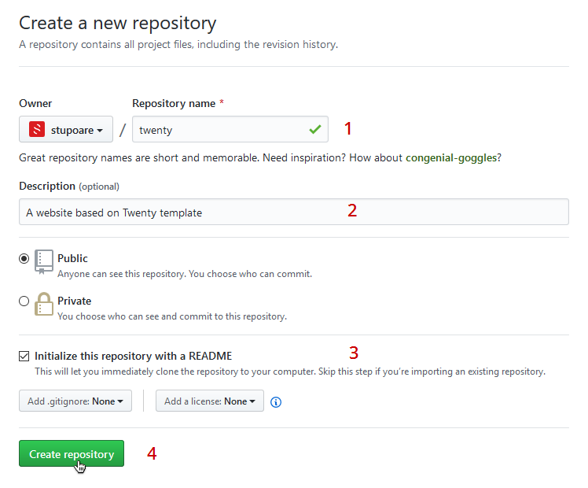
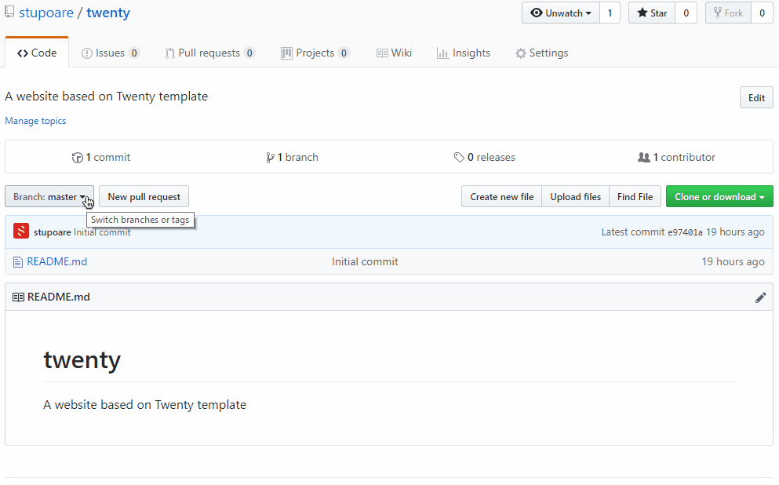
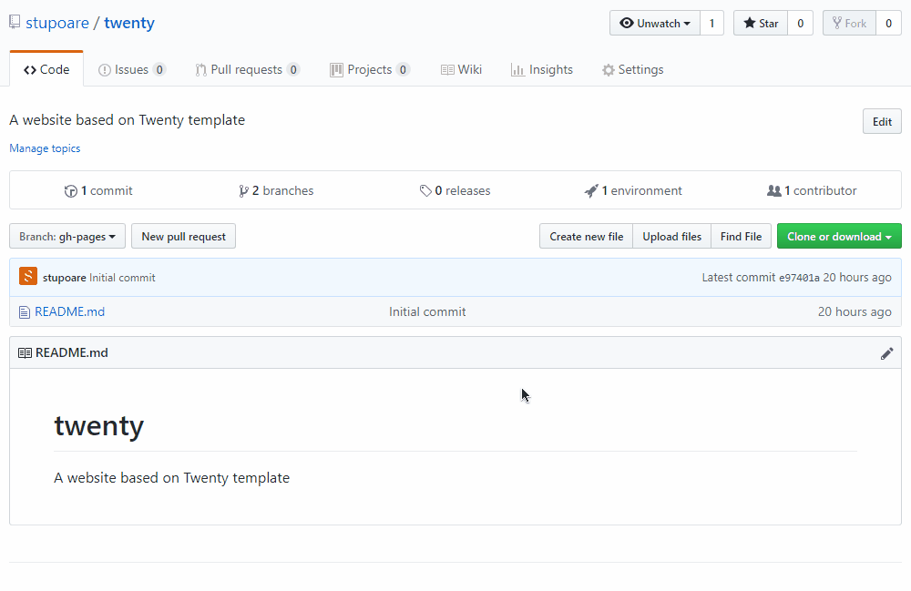
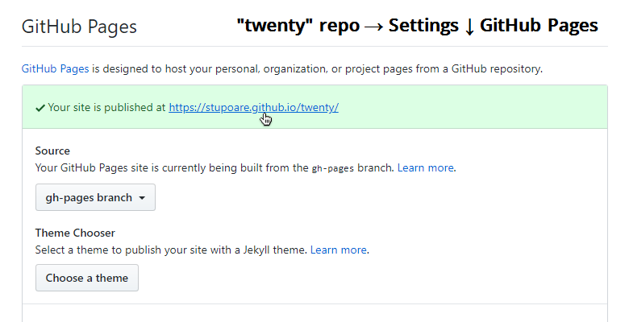

# GitHub - Pages
How to publish a Web Site in GitHub

 

## 1. Create a new repo
A website must have his own repository 
*Change "twenty" with the your web site name (no spaces)*

## 2. Follow the steps in this video :
  **[CONVERT A GITHUB REPO INTO A WEBSITE →](https://poco.squarelabel.com/tutos/media/github/01.github-convert-repo-into-website.mp4)**

 

## 3. Clone the repo and start coding :-)
  **[Support - Clone your Github repository locally →](https://github.com/powercoders-lausanne/support/tree/master/GITHUB#c-clone-your-github-repository-locally)**

<!--

### ↓ OR DO THE STEPS BELLOW ↓...

 

## 3. Convert your repo into a "gh-pages"

## 4. Make "gh-pages" as default

## 5. Make "gh-pages" as default

-->